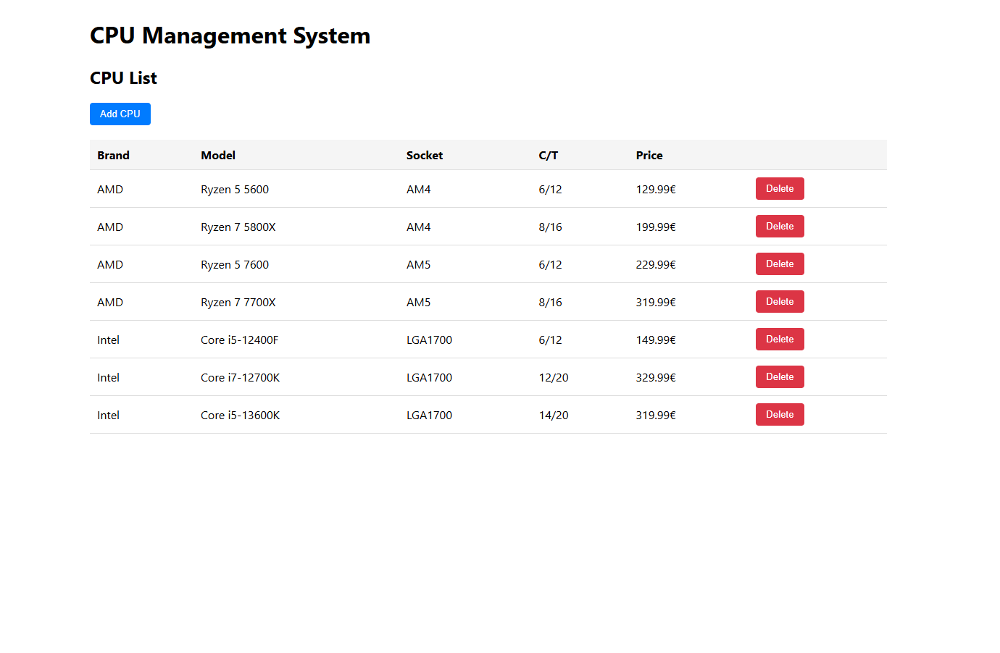
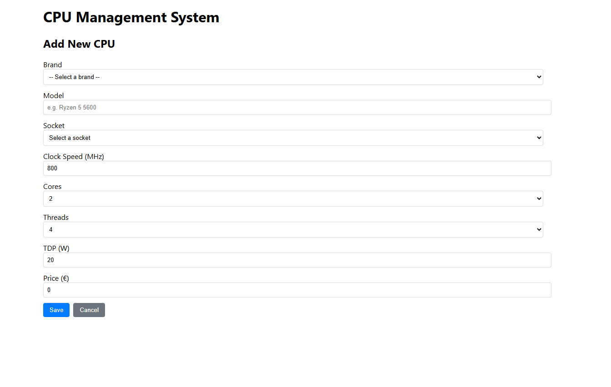
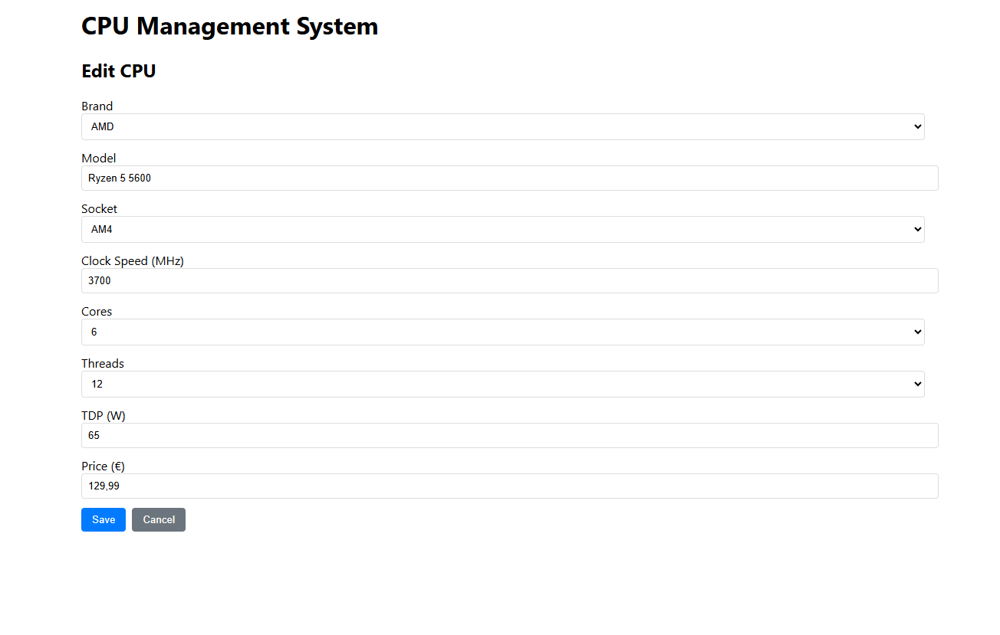
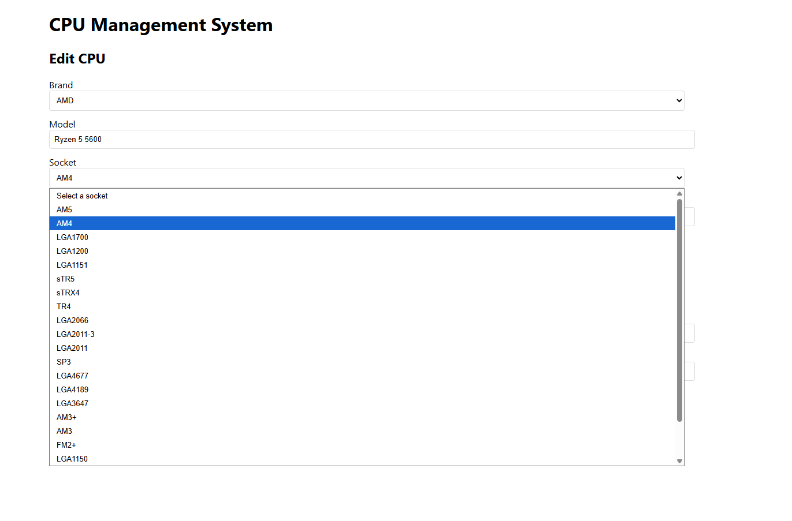

# CPU Management Web App

A simple full-stack web application for managing CPUs, built as an assessment project for **nubedian GmbH**.

## Features

- List all CPUs (brand, model, socket).
- View and edit CPU details:
  - Brand
  - Model
  - Socket (selectable from predefined list in DB)
  - Clock speed (MHz)
  - Number of cores
  - Number of threads
  - TDP (W)
  - Price (€)
- Predefined sockets (cannot be edited from UI).
- Predefined sample CPUs in the database.
- Frontend and backend run independently.

---


## Project Structure

cpu_web_app/
├── cpu_backend/                          # Spring Boot backend
│   ├── src/main/java/com/example/cpu_backend
│   │   ├── entity/                       # Entities (Cpu, SocketType)
│   │   │   ├── Cpu.java
│   │   │   └── SocketType.java
│   │   ├── repo/                         # JPA Repositories
│   │   │   ├── CpuRepository.java
│   │   │   └── SocketTypeRepository.java
│   │   ├── controller/                   # REST Controllers
│   │   │   └── CpuController.java
│   │   └── config/                       # CORS config
│   │       └── CorsConfig.java
│   └── src/main/resources/
│       └── application.properties
│
├── cpu-frontend/                         # React frontend (CRA)
│   ├── src/components/                   # React components
│   │   ├── CpuList.js                    # Shows brand, model, socket
│   │   └── CpuDetail.js                  # Shows + edits full details
│   └── src/services/
│       └── api.js                        # Axios API calls
│
└── README.md                             # Documentation


# Backend Setup

### 1. Navigate to backend folder
```bash
cd cpu_backend
```

### 2. Configure database in `src/main/resources/application.properties`
```properties
spring.datasource.url=jdbc:postgresql://localhost:5432/cpu_management
spring.datasource.username=postgres
spring.datasource.password=your_password

spring.jpa.hibernate.ddl-auto=update
spring.jpa.show-sql=true
```

### 3. Run with Maven
```bash
./mvnw spring-boot:run 
oder 
mvn spring-boot:run
```

### 4. Backend runs at
-  [http://localhost:8080/api/cpus](http://localhost:8080/api/cpus)  
-  [http://localhost:8080/api/sockets](http://localhost:8080/api/sockets)  


## Frontend Setup

### 1. Navigate to frontend folder
```bash
cd cpu-frontend
```

### 2. Install dependencies
```bash
npm install
```

### 3. Start dev server
```bash
npm start
```

### 4. Frontend runs at
-  [http://localhost:3000/](http://localhost:3000/)  


## Screenshots

### CPU List


### CPU Details Page



### CPU Edit



### Socket Dropdown



